<center><b><font size = "7">编译原理实验


<center><b><font size = "5">后缀表达式 Postfix


<center><b><font size = "5">实验报告


---


### 1 开发环境与开发工具

#### 1.1 操作系统

Windows 11

#### 1.2 编程语言

java语言，JDK版本1.7.2

#### 1.3 开发工具

Visual Studio Code + cmd


### 2 实验内容

#### 2.1 修改前实验结果

​		执行源代码，观察实验结果：

**testcase-001**

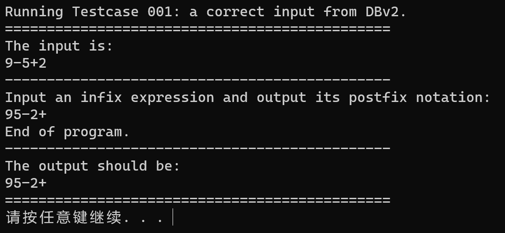

**testcase-002**

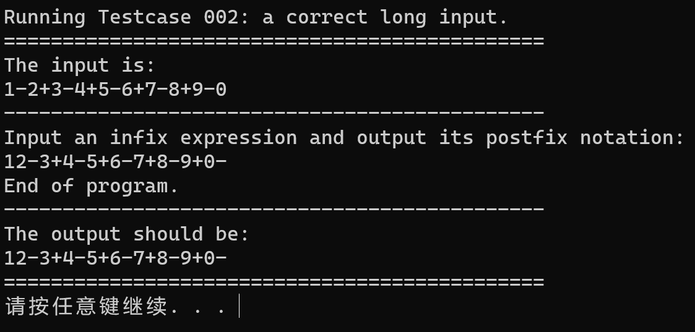

**testcase-003**

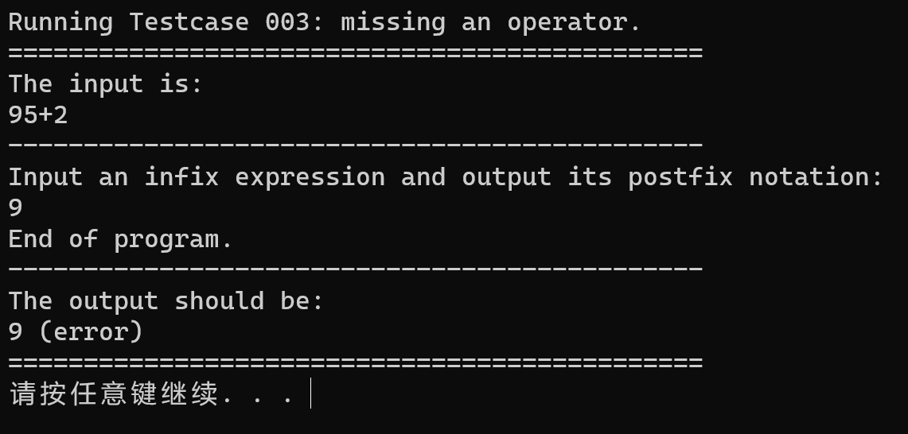

**testcase-004**

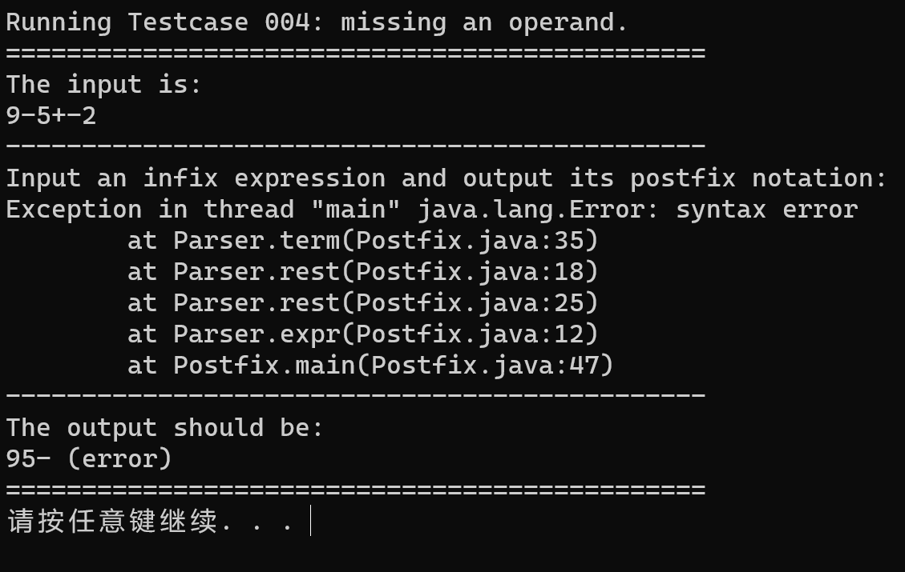

​		在源代码上，不考虑错误处理的情况下，代码的正确性是能得到验证的。


#### 2.2 静态成员与非静态成员

​		上述测试的源代码中，lookahead声明为**static**静态变量。将lookahead修改为非静态变量，也就是将static去掉，再次进行测试。**经过测试，可以得到和2中相同的实验结果。**

​		静态成员变量和非静态成员变量的区别在于：静态变量被所有对象共享，在内存中只有一个副本，它当且仅当在类初次加载时会被初始化。而非静态变量是对象所拥有的，在创建对象的时候被初始化，存在多个副本，各个对象拥有的副本互不影响。

​		分析一下：观察类Postfix，该类可以视作Parser的入口。从该类中可以发现，Parser类只实例化了一次。也就是说，该设计模式属于单例模式。因此，lookahead无论是静态成员还是非静态成员，都不会影响程序的正确性。

​		具体使用静态成员还是非静态成员更好，需要看具体的语境。当一个方法或者变量需要初始化加载，或者是经常被调用的时候可以加上static。而在一般情况下，则是使用非静态成员。在本题中，由于Parser作为单例，按道理是没有什么影响的。但lookahead作为输入流，理应需要保持数据的一致性，因此认为使用静态成员会比较好。


#### 2.3 比较消除尾递归前后程序的性能

##### 2.3.1 初步理论分析

​		首先构造一个测试数据`tc-005.infix`：我们生成了由1000001个1构成的加法输入，即
$$
\underbrace{1+1+\dots+1}_{1000001个1}
$$
​		该数据的输出`tc-005.postfix`为：
$$
1\underbrace{1+1+\dots+}_{1000000个1}
$$
​		从算法分析的角度，有无尾递归对程序的时间复杂度是基本没有影响的。在本题中，假设输入的字符串的长度为$Len$，那么无论是否有尾递归，时间复杂度均为$O(Len)$。

​		但是，我们知道，递归是通过栈的形式来实现的。递归调用函数本身，在函数调用的时候，每次调用时要做地址保存，参数传递等工作。如果递归调用$Len$次，就要分配$Len$次局部变量、$Len$次形参、$Len$次调用函数地址、$Len$次返回值，这势必是影响效率的。同时递归影响运行效率是一方面，还有另一个影响就是：递归层数过多会导致栈溢出，出现栈空间不足的情况。这也是内存溢出的原因，因为积累了大量的中间变量无法释放。如下图所示：

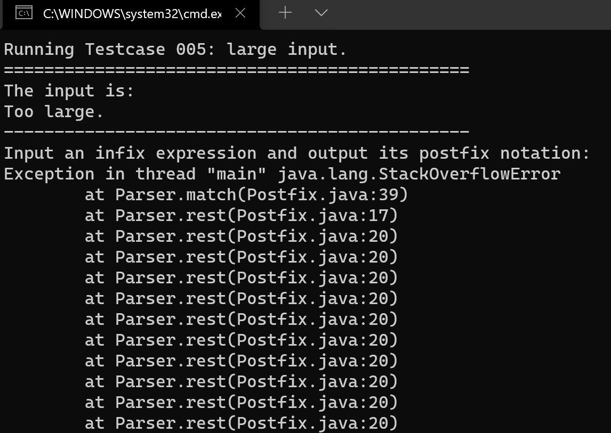

​		为了比较两者效率的影响，我们在测试的时候扩大栈空间，在编译命令处增加参数：

```bash
java -Xss515m Postfix < ..\testcases\tc-005.infix
```

​		同时，为了更好的展示结果，我们展示将输出注释掉。我们得到使用尾递归的程序的执行时间为：

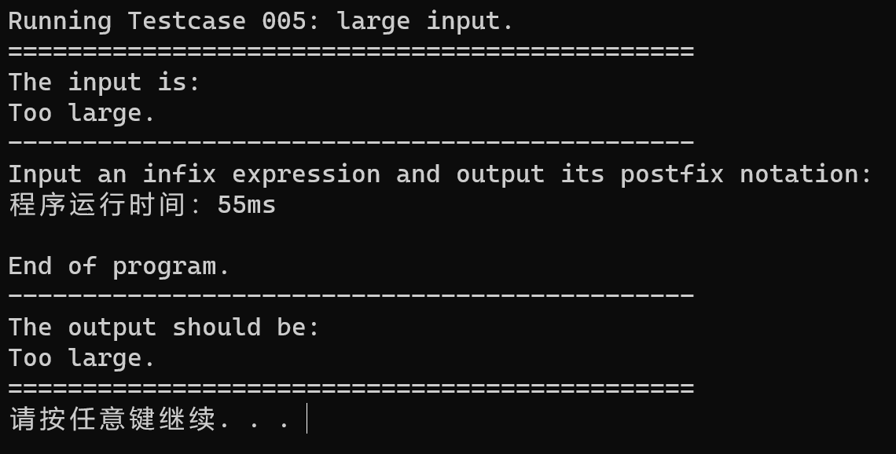

​		而消除尾递归后，程序的执行时间为：

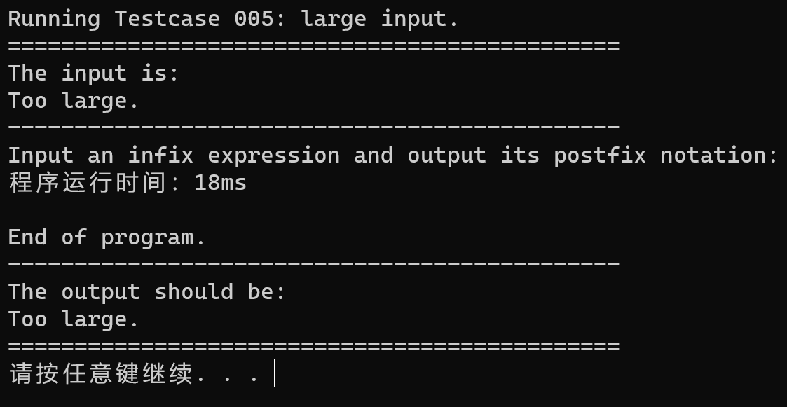

##### 2.3.2 实验数据

​		为了进行对比，1个数据显然是不足够的。因此，使用C++编写了一个数据生成器，生成了7个测试数据：

| 文件名称     | 测试数据长度（1的个数） |
| ------------ | ----------------------- |
| tc-100.infix | 10                      |
| tc-101.infix | 100                     |
| tc-102.infix | 1000                    |
| tc-103.infix | 10000                   |
| tc-104.infix | 100000                  |
| tc-105.infix | 1000000                 |
| tc-106.infix | 10000000                |

​		实验数据的长度呈指数级增长，原因在于：程序本身的复杂度是线性的，因此线性增长的数据很难清晰地观察出两种实现方式的茶饮。

##### 2.3.3 实验及实验结果

​		经过测试，我们发现，输出所消耗的时间占据程序运行时间的绝大部分。为了突出两个程序执行的效率差异，我们实验过程中将输出部分注释掉，着重关注递归对程序效率带来的影响。

​		为此，编写了一个bat脚本`testcase-time.bat`，运行这七个测试数据。将得到的程序运行时间通过表格和折线图的形式呈现：

| 测试长度（1的个数） | 使用尾递归（ms） | 未使用尾递归（ms） |
| ------------------- | ---------------- | ------------------ |
| 10                  | 1                | 0                  |
| 100                 | 0                | 0                  |
| 1000                | 1                | 1                  |
| 10000               | 2                | 3                  |
| 100000              | 7                | 14                 |
| 1000000             | 18               | 56                 |
| 10000000            | 109              | 468                |

​		接着使用python将这些数据可视化，得到折线图如下：

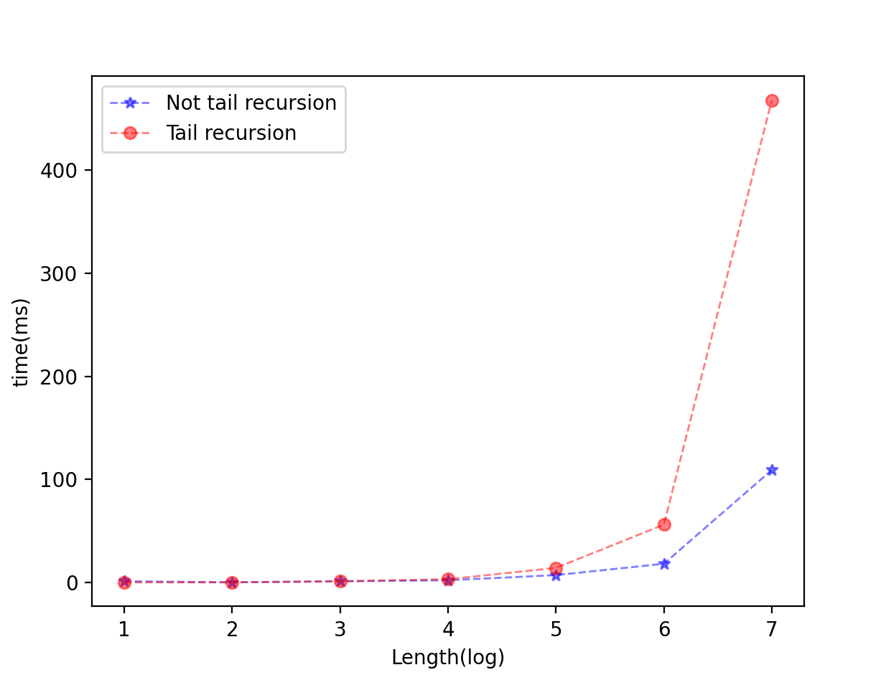

##### 2.3.4 实验结果分析

​		由此可以发现，当输入序列长度越大时，递归的层数越深，**使用尾递归的程序的时间效率会大幅度下降**。同时，**尾递归程序还会消耗大量的内存空间**，用于递归栈的使用。


#### 2.4 扩展错误处理功能

##### 2.4.1 划分错误类型

​		错误类型整体上分为两类：词法错误和语法错误。词法错误包括：出现字符集（数字和加减号）以外的字符。语法错误包括：缺少运算符、缺少左运算量。

##### 2.4.2 错误定位

​		为了实现错误的定位，增加了一个输入流指针。该指针记录了当目前为止输入流的长度，通过该指针，当错误发生的时候，就可以得知错误的位置信息。

​		该指针在扫描器扫描到下一个输入字符的时候，指针会递增1。相应的，指针的初始值为0。

##### 2.4.3 错误恢复

​		错误恢复体现在，当发现错误时，记录发现错误的位置和错误信息，并继续分析，从而一次执行可以发现所有的错误。

​		首先考虑词法错误。由于可能输入中会出现字符集以外的字符，因此在执行term或者rset的时候，需要对lookahead进行过滤，过滤掉输入流中不合法的字符，并记录错误信息和错误位置，执行的时候将这些错误字符忽略掉。实现为：使用循环读取输入流的下一个字符，直到字符属于字符集或者行末。

​		接着考虑语法错误。缺少左运算量会发生在term阶段，即我们期望读取一个数字，但lookahead却是一个加号或者减号。此时我们认为缺少左运算量，并不会匹配该符号，保留该符号，lookahead不进行匹配，并记录错误位置和错误信息。纠正的方式为，我们假设的前提是用户缺少左运算量，因此我们会添加一个下划线，代替用户输入缺少的量。而缺少运算符发生在rset阶段，我们期望读取一个符号，而实际读取了一个数字。此时我们认为缺少运算符，并不会匹配该数字，保留该数字，lookahead不进行匹配，并记录错误位置和错误信息。同理，我们也用下划线代替用户缺少输入的符号。

##### 2.4.4 实验结果

**测试词法错误：**

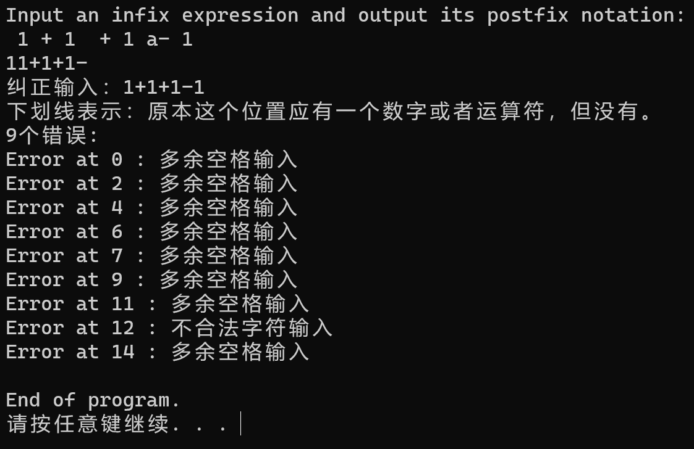

出现了空格和其他非字符集以内的字符。可以看到经过纠正后，错误被过滤掉了，并且在非字符集的位置都显示空格或者是不合法字符输入，实现了错误定位和错误恢复。

**测试语法错误：**

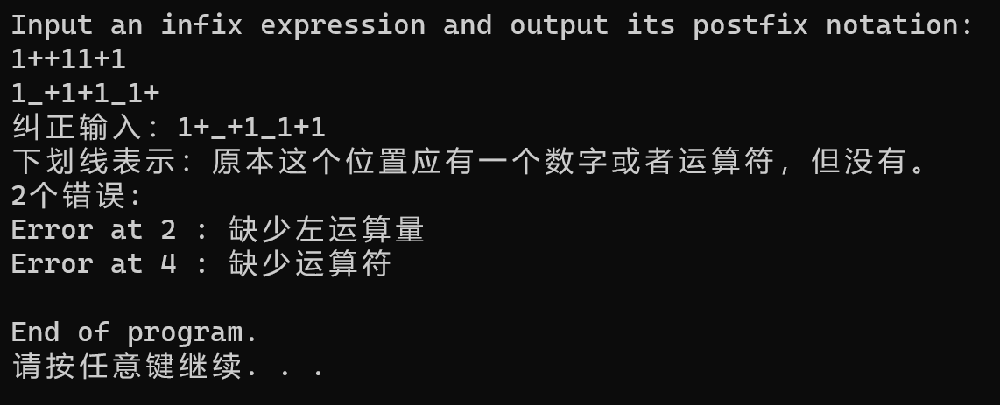

可以发现，缺少左运算量的位置和缺少运算符的位置都能够准确定位。同时，缺少的左运算量和运算符都被用下划线替代。

**综合测试：**

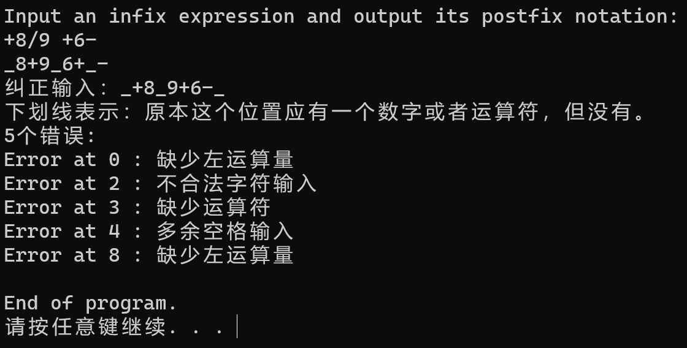

可以看到，语法错误和词法错误都被纠正了，错误的位置也被精确定位。同时，打印了纠正后的后缀表达式。

**长输入测试：**

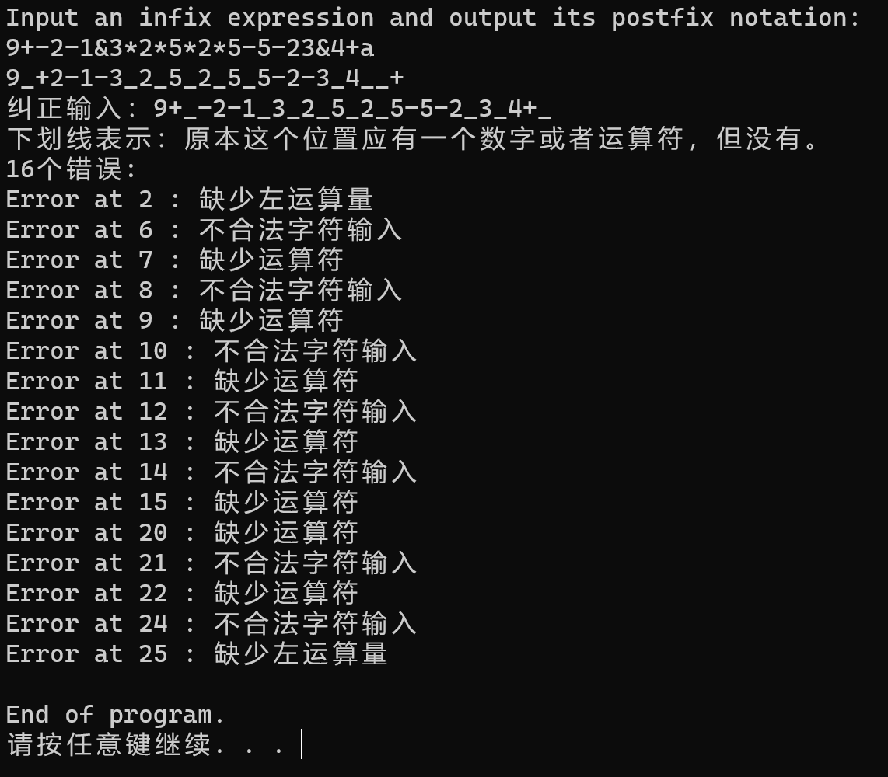

测试结果正确。


#### 2.5 Junit单元测试

##### 2.5.1 设计测试用例

​		设计了三个测试用例。

| 测试用例   | 测试目的     |
| ---------- | ------------ |
| 1 + 1 +a 1 | 测试词法错误 |
| 1++11+1    | 测试语法错误 |
| +8/9 +6-   | 综合测试     |

##### 2.5.2 Junit编写

​		将Junit的jar文件下载后，放在根目录的`util`文件内。修改`build.bat`，使之在编译的过程中，加上Junit的classpath。

​		编写Junit的测试文件：首先生成一个Parser的实例，接着编写多个测试函数，分别用于测试不用的测试用例。由于Parser的实现过程中，所有功能大多都集合在一起，因此很难对其进行拆个各个功能单元进行测试，为此，我们通过设计不同的测试用例，对不同的伪功能模块进行测试。具体的实现方式为，在测试代码中，对输入流进行**重定向**。使得lookahead读取我们预先设计好的测试用例。

##### 2.5.3 测试结果

测试一

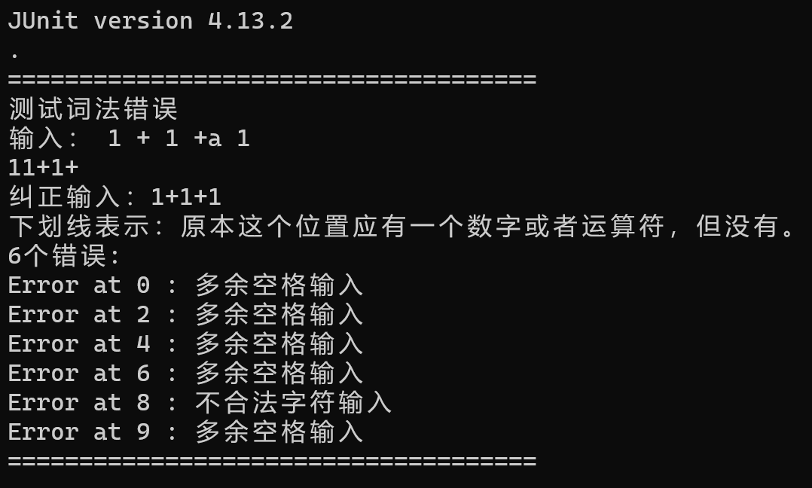

测试二

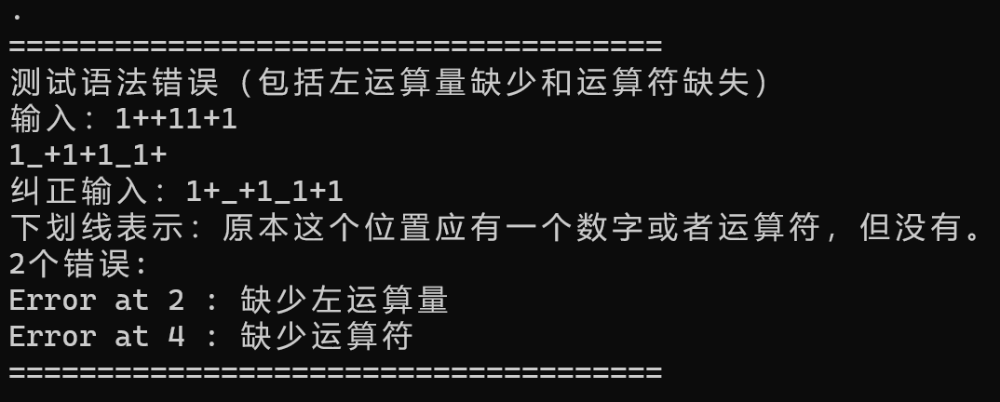

测试三

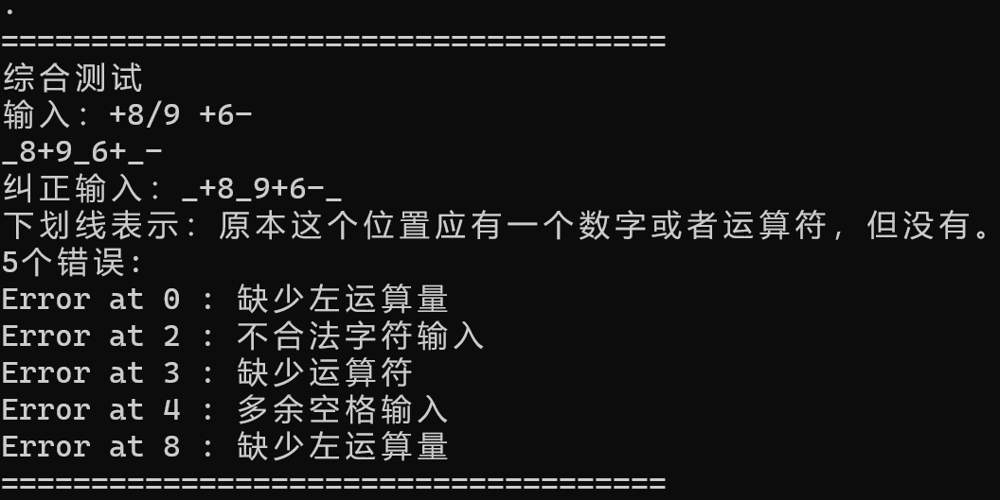


### 3 附件说明及注意事项

#### 3.1 目录

忽略doc中的文件内容。

```
D:.
│  build.bat
│  doc.bat
│  junit.bat
│  README.txt
│  run.bat
|  design.pdf
│  testcase-001.bat
│  testcase-002.bat
│  testcase-003.bat
│  testcase-004.bat
│  testcase-005.bat
│  testcase-time.bat
│  testcase.bat
│
├─bin
│      Parser.class
│      Postfix.class
│      PostfixTest.class
│
├─comparison
│  │  build.bat
│  │  doc.bat
│  │  run.bat
│  │  testcase-001.bat
│  │  testcase-002.bat
│  │  testcase-003.bat
│  │  testcase-004.bat
│  │  testcase-005.bat
│  │  testcase-time.bat
│  │  testcase.bat
│  │  time.py
│  │
│  ├─bin
│  │      Parser.class
│  │      Postfix.class
│  │
│  ├─doc
│  ├─src
│  │      Postfix.java
│  │
│  └─testcases
│          tc-001.infix
│          tc-001.postfix
│          tc-002.infix
│          tc-002.postfix
│          tc-003.infix
│          tc-003.postfix
│          tc-004.infix
│          tc-004.postfix
│          tc-005.infix
│          tc-005.postfix
│          tc-100.infix
│          tc-101.infix
│          tc-102.infix
│          tc-103.infix
│          tc-104.infix
│          tc-105.infix
│          tc-106.infix
│
├─doc
│
├─src
│      Postfix.java
│      PostfixTest.java
│
├─testcases
│      tc-001.infix
│      tc-001.postfix
│      tc-002.infix
│      tc-002.postfix
│      tc-003.infix
│      tc-003.postfix
│      tc-004.infix
│      tc-004.postfix
│      tc-005.infix
│      tc-005.postfix
│      tc-100.infix
│      tc-101.infix
│      tc-102.infix
│      tc-103.infix
│      tc-104.infix
│      tc-105.infix
│      tc-106.infix
│
└─util
        hamcrest-core-1.3.jar
        junit-4.13.2.jar
```

#### 3.2 说明

- bin中为class文件
- **comparison为用于比较尾递归效率的未修改的源代码**
- doc为javadoc文件
- src为修改后的源代码和**Junit测试代码**
- testcases为测试用例
- **util为Junit单元测试工具**
- build.bat为编译脚本
- doc.bat为javadoc脚本
- **junit.bat为单元测试运行脚本**
- **testcase-time.bat为测试尾递归效率的测试用例，不建议直接打开，建议先注释掉输出，不然会进入漫长的输出等待时间。**

